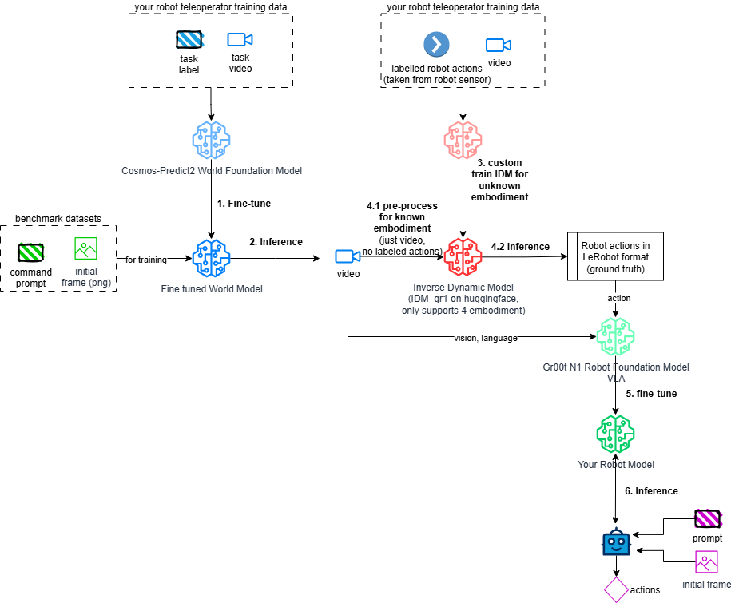

# NVIDIA-GR00T-Dreams-on-Azure

This document describes an end-to-end flow to train robotics foundation
model using synthetic data generated from NVIDIA GR00T Dreams on an
Azure VM. The process is depicted in [NVIDIA's blueprint](https://developer.nvidia.com/blog/enhance-robot-learning-with-synthetic-trajectory-data-generated-by-world-foundation-models/#gr00t-dreams_blueprint_pipeline):


The following diagram illustrates the same flow with a little more details.



The [GR00T-Dreams repo](https://github.com/NVIDIA/GR00T-Dreams) outlines
the steps for this flow. This doc provides the adjusted instructions if
you want to try it on an Azure VM.

**Key Steps**

- [Pre-requisites on Azure](#pre-requisites-on-azure)
- [Set up the environment for Cosmos-Predict2](#set-up-the-environment-for-cosmos-predict2)
- [Fine tune Cosmos-Predict2](#fine-tune-cosmos-predict2)
- [Generate synthetic video data](#generate-synthetic-video-data)
- [Custom train IDM (Inverse Dynamic Model) for your robot](#custom-train-idm-inverse-dynamic-model-for-your-robot)
- [Run IDM to get action labels for synthetic video data](#run-idm-to-get-action-labels-for-synthetic-video-data)
- [Fine tune GR00T N1 robot foundation model](#fine-tune-gr00t-n1-robot-foundation-model)
- [Run inference on the fine-tuned GR00T N1](#run-inference-on-the-fine-tuned-gr00t-n1)

## Pre-requisites on Azure

- Provision a Ubuntu 24.04 LTS VM of size `NC40ads_H100_v5` on Azure,
Standard boot, not secure boot. This VM has 1 GPU and 94GB GPU memory,
sufficient to run the GR00T-Dreams workload.

> Note that `Standard_NV36adms_A10_v5` has 24GB GPU memory and
`Standard_NV72ads_A10_v5` has 48GB, neither of which is sufficient to
run even the Cosmos-Predict2 2B model. GPU memory usage reaches around
65GB during post-training. You will get a `CUDA out of memory`
error when generating video.

## Set up the environment for Cosmos-Predict2

1. Install CUDA

    ```bash
    sudo apt update
    sudo apt install build-essential -y
    wget https://developer.download.nvidia.com/compute/cuda/repos/ubuntu2404/x86_64/cuda-keyring_1.1-1_all.deb
    sudo dpkg -i cuda-keyring_1.1-1_all.deb 
    sudo apt update
    sudo apt install cuda-toolkit-12-6
    # set PATH and LD_LIBRARY_PATH to point to the right /usr/local/cuda-12-6
    sudo apt install nvidia-gds
    sudo apt install nvidia-open
    # now you can run nvidia-smi
    ```

1. Build Cosmos-Predict2

    ```bash
    # install python venv module first, uv alone will cause strange
    # behavior in VSCode and cause just to fail.
    git clone https://github.com/nvidia-cosmos/cosmos-predict2.git
    # cd to the cosmos-predict2 folder
    uv venv
    sudo apt install libcusparselt0 libcusparselt-dev
    sudo apt install cudnn9-cuda-12
    sudo apt install libnccl2 libnccl-dev
    just install cu126
    just install-training
    ```

1. Additional Cosmos-Predict2 setup to run GR00T

    ```bash
    # this won't work: 
    # pip install openai tyro numpydantic albumentations tianshou git+https://github.com/facebookresearch/pytorch3d.git
    # because it builds the git portion in an isolated build environment which doesn't have torch,
    # even though torch is in the venv.
    # run this instead:
    uv pip install openai tyro numpydantic albumentations tianshou
    uv pip install --no-build-isolation git+https://github.com/facebookresearch/pytorch3d.git
    ```

## Fine tune Cosmos-Predict2

In this example, we use Gr1 as our robot embodiment as it's
already supported by the provided IDM and GR00T N1 fine-tuning
script.

1. Download Cosmos-Predict2 model checkpoints

    * Sign up for Huggingface and apply for meta llama 3.1 gated repo access.
    * Install huggingface cli `uv tool install -U "huggingface_hub[cli]"`

    ```bash
    hf auth login
    ./scripts/download_checkpoints.py --model_types video2world --model_sizes 2B
    ./scripts/download_checkpoints.py --model_types sample_gr00t_dreams_gr1
    # gr00t for gr1 is only 14B. Here, we are not yet fine-tuning gr00t, we are
    # fine-tuning Cosmos-predict2-2B-video2world based on gr00t dataset
    ```

1. Download training dataset for Gr1

    ```bash
    huggingface-cli download nvidia/GR1-100 --repo-type dataset --local-dir datasets/benchmark_train/hf_gr1/ && \
    mkdir -p datasets/benchmark_train/gr1/videos && \
    mv datasets/benchmark_train/hf_gr1/gr1/*mp4 datasets/benchmark_train/gr1/videos && \
    mv datasets/benchmark_train/hf_gr1/metadata.csv datasets/benchmark_train/gr1/

    # This dataset is about 100 pairs of prompt and videos that gr1 performed tasks
    # preprocess data: text prompt and video to embedding,
    python -m scripts.get_t5_embeddings_from_groot_dataset --dataset_path datasets/benchmark_train/gr1
    ```

1. Use the Gr1 dataset to post-train Cosmos-Predict2 model video2world

    ```bash
    # by default this will run max 400K iterations see cosmos_predict2/configs/base/config.py for configuration
    # see cosmos_predict2/configs/base/experiment/groot.py, predict2_video2world_training_2b_groot_gr1_480 for dataloader info
    EXP=predict2_video2world_training_2b_groot_gr1_480
    torchrun --nproc_per_node=1 --master_port=12341 -m scripts.train --config=cosmos_predict2/configs/base/config.py -- experiment=${EXP}
    # output will be saved to checkpoints/posttraining/video2world/2b_groot_gr1_480
    ```

## Generate synthetic video data

1. Run inference of the post-trained model on a prompt with a single image

    ```bash
    python examples/video2world.py \
      --model_size 2B \
      --dit_path "checkpoints/posttraining/video2world/2b_groot_gr1_480/checkpoints/model/iter_000001600.pt" \
      --prompt "Use the right hand to pick up rubik\'s cube from from the bottom of the three-tiered wooden shelf to to the top of the three-tiered wooden shelf." \
      --input_path assets/sample_gr00t_dreams_gr1/8_Use_the_right_hand_to_pick_up_rubik\'s_cube_from_from_the_bottom_of_the_three-tiered_wooden_shelf_to_to_the_top_of_the_three-tiered_wooden_shelf..png \
      --save_path output/generated_video_from_post-training.mp4
    ```

1. Generate synthetic video data by running inference on the post-trained model on a benchmark dataset
    This dataset has pairs of prompt and images of many robot tasks.

    ```bash
    # download DreamGen dataset
    huggingface-cli download nvidia/EVAL-175 --repo-type dataset --local-dir dream_gen_benchmark
    # prepare batch input json
    python -m scripts.prepare_batch_input_json \
      --dataset_path dream_gen_benchmark/gr1_object/ \
      --save_path output/dream_gen_benchmark/cosmos_predict2_14b_gr1_object/ \
      --output_path dream_gen_benchmark/gr1_object/batch_input.json
    # use torchrun to parallelize, but we only have one GPU
    ```

    To verify we prepare the batch correctly, try it on just one synthetic file

    ```bash
    mkdir gr1_small_object
    cp gr1_object/0_* gr1_small_object/

    python -m scripts.prepare_batch_input_json \
      --dataset_path dream_gen_benchmark/gr1_small_object/ \
      --save_path output/dream_gen_benchmark/cosmos_predict2_14b_gr1_small_object/ \
      --output_path dream_gen_benchmark/gr1_small_object/batch_input.json

    python -m examples.video2world \
      --model_size 2B \
      --dit_path "checkpoints/posttraining/video2world/2b_groot_gr1_480/checkpoints/model/iter_000001600.pt" \
      --batch_input_json dream_gen_benchmark/gr1_small_object/batch_input.json \
      --disable_guardrail
    ```

    Inference on the entire batch

    ```bash
    python -m examples.video2world_gr00t \
      --model_size 14B \
      --gr00t_variant gr1 \
      --batch_input_json dream_gen_benchmark/gr1_object/batch_input.json \
      --disable_guardrail
    ```

    See [Inference with Cosmos-Reason1 Rejection Sampling](https://github.com/nvidia-cosmos/cosmos-predict2/blob/main/documentations/post-training_video2world_gr00t.md#5-inference-with-cosmos-reason1-rejection-sampling)
    for how to filter the generated video.

## Custom train IDM (Inverse Dynamic Model) for your robot

The IDM in the NVIDIA Dreams repo only supports target embodiment of
Franka, Gr1, Soo100, and Robocasa. If you don't already have one for
your robot, you need to train an IDM.

  ```bash
  # supply your own demo_data/robot_sim.PickNPlace/
  PYTHONPATH=. torchrun scripts/idm_training.py --dataset-path demo_data/robot_sim.PickNPlace/ --embodiment_tag <your_robot>
  ```

See [Training Custom IDM model](https://github.com/NVIDIA/GR00T-Dreams?tab=readme-ov-file#optional-33-training-custom-idm-model)
for more details. The doc mentions that for a new embodiment, you need to provide `modality` and `stats`.
`modality` is telling the training code which columns in the state and action vectors are, for example, left arm.
`stats` is the statistical distribution of the columns in the state and action vectors.

Conceptually, IDM training is about taking the states (ex. join positions) and/or observations (ex. video frames)
at time _t_ and _t+1_, combined with a prompt, to predict the action that needs to be taken from the state at _t_
to state at _t+1_. So, `(s_t, s_t+1, o_t, o_t+1) -> a_t`

At inference time, we only have a video and prompt, no existing state, so how does it work?
The states, observations, prompt, and actions are encoded into the same latent space.
So at inference time, state is inferred from observations. `(o_t, o_t+1) -> a_t`

## Run IDM to get action labels for synthetic video data

1. Convert generated synthetic data folder for use with IDM

    ```bash
    git clone https://github.com/NVIDIA/GR00T-Dreams.git
    # compile
    # delete pyav from pyproject.toml
    #   +requires-python = ">=3.10,<3.12"
    #   +    "transformers==4.46.2",
    uv sync
    poetry install
    # update IDM_dump/scripts/preprocess/gr1.sh to set num_of_gpu to 1

    python IDM_dump/convert_directory.py --input_dir "../cosmos-predict2/output/dream_gen_benchmark/cosmos_predict2_14b_gr1_small_object/" --output_dir "results/dream_gen_benchmark/cosmos_predict2_14b_gr1_small_object_step3"
    
    python IDM_dump/split_video_instruction.py --source_dir "results/dream_gen_benchmark/cosmos_predict2_14b_gr1_small_object_step3/Use the left hand to pick up dark green cucumber from on circular gray mat to above beige bowl./" --output_dir "IDM_dump/data/gr1_data"

    python IDM_dump/preprocess_video.py --src_dir "IDM_dump/data/gr1_data" --dst_dir "IDM_dump/data/gr1_data_split" --dataset gr1

    # convert to lerobot format
    python IDM_dump/raw_to_lerobot.py --input_dir "IDM_dump/data/gr1_data_split" --output_dir "IDM_dump/data/gr1_unified.data" --cosmos_predict2
    ```

1. Run IDM to add actions to the synthetic data

    ```bash
    python IDM_dump/dump_idm_actions.py --checkpoint "seonghyeonye/IDM_gr1" --dataset "IDM_dump/data/gr1_unified.data" --output_dir "IDM_dump/data/gr1_unified.data_idm" --num_gpus 1 --video_indices "0 8"
    ```

## Fine tune GR00T N1 robot foundation model

The fine-tuning scripts are in `IDM_dump/scripts/*_finetune`. The NVIDIA repo
currently only supports franka, gr1, so100, and robocasa out-of-the-box. You
need to create your own for another embodiment, see
[2_new_embodiment_finetuning](https://github.com/NVIDIA/GR00T-Dreams/blob/main/getting_started/3_new_embodiment_finetuning.ipynb).

  ```bash
  torchrun scripts/gr00t_finetune.py --dataset-path "IDM_dump/data/gr1_unified.data_idm" --data-config gr1_arms_waist --embodiment_tag "gr1"  

  # fine-tuned checkpoint is in /tmp/gr00t
  cp -r /tmp/gr00t/checkpoint-5000 results/gr00t/
  ```

## Run inference on the fine-tuned GR00T N1

  See [1_gr00t_inference.ipynb](https://github.com/NVIDIA/GR00T-Dreams/blob/main/getting_started/1_gr00t_inference.ipynb)
  for the complete code.

  ```python
  # loading dataset
  import numpy as np

  modality_config = policy.modality_config

  print(modality_config.keys())

  for key, value in modality_config.items():
      if isinstance(value, np.ndarray):
          print(key, value.shape)
      else:
          print(key, value)

  # Create the dataset
  dataset = LeRobotSingleDataset(
      dataset_path=DATASET_PATH,
      modality_configs=modality_config,
      video_backend="decord",
      video_backend_kwargs=None,
      transforms=None,  # We'll handle transforms separately through the policy
      embodiment_tag=EMBODIMENT_TAG,
  )

  # print out a single data point
  step_data = dataset[0]

  print(step_data)

  print("\n\n ====================================")
  for key, value in step_data.items():
      if isinstance(value, np.ndarray):
          print(key, value.shape)
      else:
          print(key, value)

  print("\n\n ========Prediction==================")
  predicted_action = policy.get_action(step_data)
  for key, value in predicted_action.items():
      print(key, value.shape)

  ```

**Additional Concepts**

## How does multi-view dataset work?

- All camera views are used to train a single model.
- At inference time, provide a single image with a grid of views from multiple cameras,
 and the prompt that explains each camera view. Run through the single post-trained model
 to get output videos for all cameras. See the [DROID example](https://github.com/nvidia-cosmos/cosmos-predict2/blob/main/documentations/post-training_video2world_gr00t.md#3-inference-for-gr00t-dreams-checkpoints).
- How's the multi-view model trained? I can't find an training example for DROID in
 [Cosmos-Predict](https://github.com/nvidia-cosmos/cosmos-predict2/blob/main/documentations/post-training_video2world_gr00t.md#video2world-post-training-for-dreamgen-bench), however, it does have an example to 
 [post-train a multi-view Cosmos-Predict model for waymo](https://github.com/nvidia-cosmos/cosmos-predict2/blob/main/documentations/post-training_multiview_waymo.md) which seems to work similarly to DROID.
 Note that in the training data, each camera video file and their respective prompt are provided
 separately, different from the input for inference.

## How does the Cosmos Reason model work in DreamGen?

The Cosmos-Reason model can do, for example,

- generate captions for a video
- find all the events in a video and generate the caption for each event
- find anomaly in a video
- answer questions such as "what are the potential safety hazard?"
- generate multiple output videos, or "rollouts", from the same input, critique and
score each rollout to find the best-of-n. This is what can be used in Cosmos-Predict
to improve the quality of the generated video.
