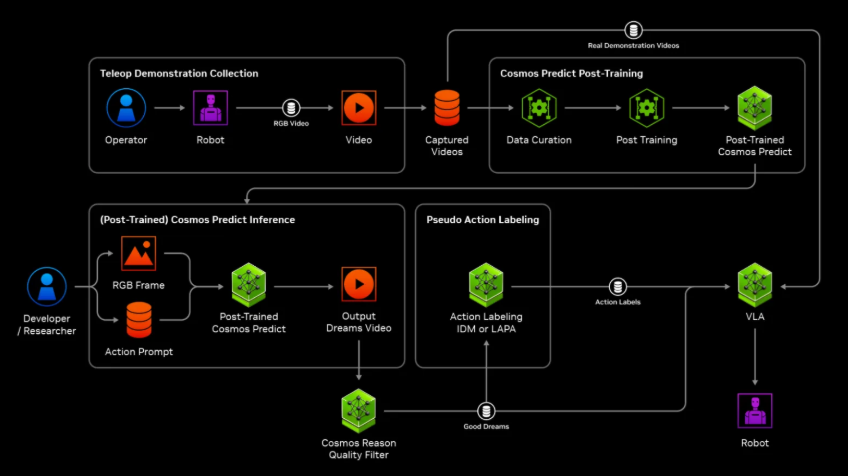

# NVIDIA-GR00T-Dreams-on-Azure

This document describes an end-to-end flow to train robotics foundation
model using synthetic data generated from NVIDIA GR00T Dreams on an
Azure VM. The process is depicted in NVIDIA's blueprint below:



The [GR00T-Dreams repo](https://github.com/NVIDIA/GR00T-Dreams) outlines
the steps for this flow. This doc provides the adjusted instructions if
you were to try it on an Azure VM.

## Pre-requisites on Azure

* Provision a Ubuntu 24.04 LTS VM of size `NC40ads_H100_v5` on Azure,
Standard boot, not secure boot. This VM has 1 GPU and 94GB GPU memory,
sufficient to run the GR00T-Dreams workload.

> Note that `Standard_NV36adms_A10_v5` has 24GB GPU memory and
`Standard_NV72ads_A10_v5` has 48GB, neither of which is sufficient to
run even the Cosmos-Predict2 2B model. GPU memory usage reaches around
65GB during post-training. You will get a `CUDA out of memory`
error when generating video.

## Set up the environment for Cosmos-Predict2

1. Install CUDA

    ```bash
    sudo apt update
    sudo apt install build-essential -y
    wget https://developer.download.nvidia.com/compute/cuda/repos/ubuntu2404/x86_64/cuda-keyring_1.1-1_all.deb
    sudo dpkg -i cuda-keyring_1.1-1_all.deb 
    sudo apt update
    sudo apt install cuda-toolkit-12-6
    # set PATH and LD_LIBRARY_PATH to point to the right /usr/local/cuda-12-6
    sudo apt install nvidia-gds
    sudo apt install nvidia-open
    # now you can run nvidia-smi
    ```

1. Build Cosmos-Predict2

    ```bash
    # install python venv module first, uv alone will cause strange
    # behavior in VSCode and cause just to fail.
    git clone https://github.com/nvidia-cosmos/cosmos-predict2.git
    # cd to the cosmos-predict2 folder
    uv venv
    sudo apt install libcusparselt0 libcusparselt-dev
    sudo apt install cudnn9-cuda-12
    sudo apt install libnccl2 libnccl-dev
    just install cu126
    just install-training
    ```

1. Additional Cosmos-Predict2 setup to run GR00T

    ```bash
    # this won't work: 
    # pip install openai tyro numpydantic albumentations tianshou git+https://github.com/facebookresearch/pytorch3d.git
    # because it builds the git portion in an isolated build environment which doesn't have torch,
    # even though torch is in the venv.
    # run this instead:
    uv pip install openai tyro numpydantic albumentations tianshou
    uv pip install --no-build-isolation git+https://github.com/facebookresearch/pytorch3d.git
    ```

1. Download Cosmos-Predict2 model checkpoints

    * Sign up for Huggingface and apply for meta llama 3.1 gated repo access.
    * Install huggingface cli `uv tool install -U "huggingface_hub[cli]"`

    ```bash
    hf auth login
    ./scripts/download_checkpoints.py --model_types video2world --model_sizes 2B
    ./scripts/download_checkpoints.py --model_types sample_gr00t_dreams_gr1
    # gr00t for gr1 is only 14B. Here, we are not yet finetuning gr00t, we are
    # finetuning Cosmos-predict2-2B-video2world based on groot dataset
    ```
